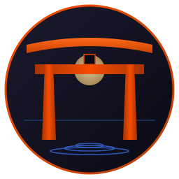

# torii



  

Captive-portal listener for NetworkManager. Replaces Firefox's removed
"Open network login page" banner with a single small daemon that
opens Firefox at the gateway IP when a portal is detected.

Member of the [Fe₂O₃](https://github.com/isene/fe2o3) Rust terminal
suite ([landing page](https://isene.org/fe2o3/)).

<br clear="left"/>

## What it does

Subscribes to `NetworkManager.PropertiesChanged` on the system D-Bus
and watches the `Connectivity` property:

| Transition | Action |
|---|---|
| `* → portal` (value 2) | Critical dunst notification + `gaze http://<gateway-ip>/`, or firefox where there is no gaze |
| `portal → full` | Low-urgency "Connected" notification |
| anything else | ignored |

Signal-driven only. The process parks in `epoll_wait` on the D-Bus
socket and only resumes when NM emits a real connectivity transition.
Idle CPU = 0. NM already runs the connectivity probe periodically;
torii adds nothing on top of that — it just listens.

## Why this exists

Mozilla removed Firefox's "Open network login page" banner. Without
it, joining hotel / airport / coffee-shop wifi means manually noticing
that nothing loads, guessing the gateway IP, and opening it. torii
restores the banner's behavior in a window-manager-independent way.

## Footprint

- **1.9 MB** stripped binary
- **~4 MB** resident memory idle
- **0** wakeups per second when the network is steady
- One subprocess spawn (`gaze`) per actual portal event

## Install

```sh
PATH="/usr/bin:$PATH" cargo build --release
ln -sf "$(pwd)/target/release/torii" ~/bin/torii
```

Autostart from your WM config (`~/.tilerc`, `~/.xprofile`, systemd
`--user` unit, etc.):

```
exec /home/geir/bin/torii
```

## Usage

```sh
torii            # daemon mode (long-lived, signal-driven)
torii --once     # read current connectivity once and exit
```

Logs to stderr, prefixed `[torii]`. Every transition is logged.

## Testing without travelling

Hijack `detectportal.firefox.com` to a local server returning a non-
canonical response (iptables redirect or `/etc/hosts` + a tiny HTTP
server returning anything other than `success\n`). NM's connectivity
check will fall to `portal`; torii fires.

## Why "torii"

A torii (鳥居) is the Japanese sacred gate marking the threshold
between mundane and sacred space. This daemon watches the threshold
between your machine and the network, then acts on the transition.

## Why Rust, not asm

The other half of [the author's stack](https://github.com/isene/chasm)
is x86_64 assembly when speed matters in a hot loop. D-Bus protocol
parsing (SASL, typed message marshaling, variant signatures, match
rules) is thousands of lines of fiddly code, and the daemon is
asleep 99.999% of the time — asm wins (microsecond startup, tiny
binary) don't apply when the process is started once and lives
forever. Rust + zbus is the right tool here.

## Part of Fe₂O₃

| Tool | Repo | Role |
|---|---|---|
| **fe2o3** (umbrella) | <https://github.com/isene/fe2o3> | Suite landing page |
| rush | <https://github.com/isene/rush> | Interactive shell |
| pointer | <https://github.com/isene/pointer> | File manager |
| kastrup | <https://github.com/isene/kastrup> | Messaging hub |
| scribe | <https://github.com/isene/scribe> | Modal editor |
| scroll | <https://github.com/isene/scroll> | Web browser |
| tock | <https://github.com/isene/tock> | Calendar |
| astro | <https://github.com/isene/astro> | Astronomy |
| watchit | <https://github.com/isene/watchit> | Movies |
| **torii** | <https://github.com/isene/torii> | Captive-portal listener |

## License

Unlicense (public domain).
